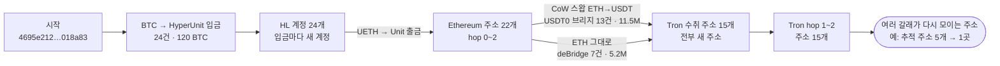
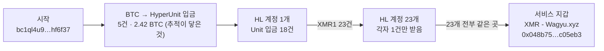
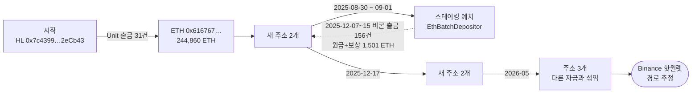

# 추적 결과 요약 — 사례 3건

`tracker` 파이프라인을 공개 데이터로 실제 실행한 결과 (데이터 조회 2026-10-03 UTC).
각 사례의 전체 보고서는 아래 명령으로 다시 만들 수 있다 (`out/<사례>/pipeline.md`).

> 주소 연결은 "자금이 어디로 갔는가"만 보여준다. 소유권·불법성의 증명이 아니다.
> **경로 확실도**는 시작점부터 그 지점까지 구간 확실도 중 가장 낮은 값이다: `확정` > `계정 단위 확정` > `추정`.

## 한 줄 요약

| 사례 | 시작 | 경로 | 최종 도착 |
|---|---|---|---|
| 1 | BTC tx `4695e212…` | BTC 120개 → HL 계정 24개 → ETH → 스왑·브리지 → Tron에서 다시 분산 | **Tron**, 수취 주소 15개, 약 1,670만 USDT. 이후 Tron 안에서 여러 주소로 퍼지며 일부는 같은 곳에 다시 모임 |
| 2 | BTC 주소 `bc1ql4u9…` | BTC → HL 계정 1개 → XMR1 매수 → 계정 23개로 분산 → 다시 한곳으로 | **Wagyu.xyz 서비스 지갑** (XMR1 → 실제 모네로 전환 추정, 이후 추적 불가) |
| 3 | HL 계정 `0x7c4399…` (800 BTC 건) | HL → ETH 24.5만 개 → **스테이킹 3개월** → 원금+보상 회수(비콘 출금 156건으로 확인) → 주소 이동 | **Binance** 핫월렛 (마지막 구간은 다른 자금과 섞여 `추정`) |

## 사례 1 — 쪼개기 → 스왑 → 브리지 → Tron



- **HL 구간**: BTC 입금 24건이 각자 새 HL 계정으로 들어갔다. 계정마다 입금 1건이 유일한 자금원이라 24개 전부 `확정`. 모두 UETH로 바꿔 HyperUnit으로 Ethereum 출금.
- **Ethereum 구간**: 출금 주소 5개에서 새 주소 17개로 300~600 ETH씩 쪼갠 뒤, 대부분 CoW Swap으로 ETH를 USDT로 바꿔 USDT0(LayerZero OFT) 브리지로 보냈다. 일부는 ETH 그대로 deBridge로 보냈다.
- **도착**: 브리지 20건이 전부 Tron에 도착했다 (USDT0 13건 1,149만 + deBridge 7건 517만 USDT). deBridge 주문 1건은 취소돼 환불됐고, 같은 주소가 그 돈을 USDT0로 다시 보냈다.
- **Tron 구간**: 수취 주소 15개는 전부 처음 쓰는 주소이고, 건당 1.5 USDT를 내는 수수료 대납 스마트 계정이었다. 받은 USDT를 30만·100만 단위로 다시 나눠 보냈고, 여러 갈래가 같은 주소로 다시 모였다 (추적 주소 5개 → 1곳, 3개 → 1곳이 3군데). 2홉·30개 상한에서 멈췄고, 그 너머 52건은 리드로 남았다. 리드 합계(2,027만)가 도착액보다 큰 것은 hop 1부터 다른 자금이 섞인 주소가 많아서다 (`추정`).
- **확실도**: 출금 주소 3개는 BTC 추적이 닿지 않은 다른 HL 계정의 출금이 같이 들어와 `추정`이다. 사례 1 전체 79개 계정 중 BTC 추적이 닿은 것은 24개다.
- **노이즈**: 출금 주소마다 주소 오염(앞뒤 4자리가 닮은 주소의 먼지 입금)이 271~2,927건 쌓여 있었다. 심볼이 "ETH"인 가짜 토큰도 대량으로 섞여 있었다.

## 사례 2 — 분산 → 재집결 → 프라이버시 코인 서비스



- **HL 구간**: 계정 1개가 BTC를 팔아 XMR1(모네로 래핑 토큰)을 사서 1,302 XMR1을 23개 계정으로 나눠 보냈다. 받은 23개 계정은 각자 그 1건만 받았고(`확정`), 전부 같은 주소 `0x048b75…`로 XMR1을 다시 보냈다.
- **허브 정체**: `0x048b75…`는 원장 8,502건(받은 것 1,297건, 보낸 것 7,205건)의 지갑이다. 이 지갑에 자금을 넣은 주소 중 **XMR1·TRX1·ZEC1의 발행자**(`0x207700…`, Wagyu.xyz)가 있다. 즉 Wagyu.xyz의 운영 지갑이다.
- **해석**: XMR1을 서비스 지갑으로 보낸 것은 Wagyu를 통해 실제 모네로로 바꾸는 흐름으로 보인다. 모네로는 거래 내역이 공개되지 않으므로 공개 데이터 추적은 여기서 끝난다.

## 사례 3 — 스테이킹으로 묵힌 뒤 거래소



- **Ethereum 구간**: ETH 출금 31건(244,860 ETH)이 한 주소로 모인 뒤 새 주소 2개로 나뉘었다(79,850 / 165,010 ETH). 둘 다 바로 `EthBatchDepositor`에 3만 ETH씩 넣어 이더리움 스테이킹을 했다.
- **회수**: 약 3개월 뒤(2025-12-07 ~ 12-15) 비콘 체인 출금으로 두 주소에 각각 80,338.8 ETH(51건)와 166,022.7 ETH(105건)가 돌아왔다. 예치액보다 488.8 + 1,012.7 = **약 1,501 ETH 많은데, 스테이킹 보상**이다. 비콘 출금은 일반 tx가 아니라 별도 기록이라 따로 받아 확인했다. 두 주소는 12월 17일 회수액 전부를 새 주소 2개로 옮겼다.
- **도착**: 2026년 5월 주소 3개를 거쳐 Binance 핫월렛으로 들어갔다. 이 3개 주소는 이전부터 큰 자금(예: 15.5만 ETH)이 있던 주소라 마지막 구간은 `추정`이다. 그 전 구간까지는 `계정 단위 확정`이다.

## 사례를 가로지르는 패턴

1. **계정·주소 분산이 연결을 오히려 확정시킨다**: 사례 1은 입금마다 새 HL 계정을, 사례 2는 1건씩만 받는 계정 23개를 썼다. 계정마다 자금원이 하나뿐이라 1:1 연결이 `확정`된다.
2. **체인을 여러 번 바꾼다**: BTC → Hyperliquid → Ethereum → Tron. 체인이 바뀔 때마다 HyperUnit·deBridge·LayerZero 같은 다른 프로토콜의 기록을 이어야 한다.
3. **스왑과 브리지를 함께 쓴다**: 자산(ETH→USDT)과 체인(Ethereum→Tron)이 같이 바뀐다. 파이프라인은 DEX 스왑을 종착이 아닌 전환으로 이어 붙인다.
4. **출구는 세 종류였다**: 스테이블코인으로 Tron(사례 1), 프라이버시 코인 서비스(사례 2), 시간을 두고 대형 거래소(사례 3).
5. **공개 데이터에 노이즈가 많다**: 주소 오염 스팸, 가짜 토큰, 취소된 브리지 주문, 태그 없는 서비스 지갑. 각각 걸러내거나 따로 판정해야 결과를 믿을 수 있다.

## 재현

```bash
python3 -m pipeline --tx 4695e2121fa84fd1d7ca41a8f481774bdf383e231cf290f56c6ac734bc018a83 --out out/case1
python3 -m pipeline --address bc1ql4u94klk265lnfur2ujk9p6uh52f2a8jhf6f37 --out out/case2 --hl-hops 2
python3 -m pipeline --hl 0x7c4399A2E5752A57703391da290ce684C12eCb43 --out out/case3 --eth-hops 4
```

한 번 받은 원자료는 `--reuse`로 다시 쓸 수 있다 (사례당 수 초). 처음 실행은 BTC 추적(Esplora)과 Ethereum(Blockscout) 공개 API 속도에 따라 사례당 1~10분.
